<!-- omit in toc -->
# Adaptive Milling user guide v1.0

**The Rosalind Franklin Instutute**

**Authors: Thomas Glen, Casper Berger & Thomas Fish**

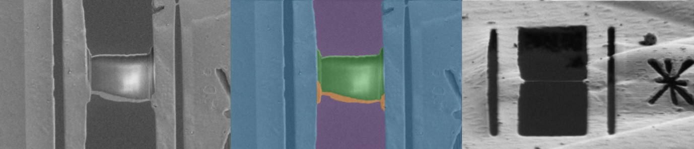

<!-- omit in toc -->
### Table of Contents

- [1. Introduction](#1-introduction)
- [2. Setting up a new session using an existing protocol](#2-setting-up-a-new-session-using-an-existing-protocol)
  - [Starting adaptive milling software in Autolamella](#starting-adaptive-milling-software-in-autolamella)
  - [Using a protocol file](#using-a-protocol-file)
  - [Create a lamella overview (before GIS deposition)](#create-a-lamella-overview-before-gis-deposition)
  - [Using the minimap](#using-the-minimap)
  - [Setting up lamella sites](#setting-up-lamella-sites)
  - [Refining the fiducial position](#refining-the-fiducial-position)
  - [Starting the milling](#starting-the-milling)
- [3. Protocol files (editing and further details)](#3-protocol-files-editing-and-further-details)
  - [Example protocols](#example-protocols)
  - [Protocol editing](#protocol-editing)
  - [Adaptive Polishing settings](#adaptive-polishing-settings)
- [4. Outputs and assessing Adaptive Milling performance](#4-outputs-and-assessing-adaptive-milling-performance)

## 1. Introduction

This guide describes how to use the Adaptive Polish milling strategy, part of the Adaptive Milling plugins for fibsemOS. Please use this guide in conjunction with the [fibsemOS documentation](https://www.fibsemos.org/docs/). We recommend following the fibsemOS ['Getting started' guide](https://www.fibsemos.org/docs/getting-started/) before continuing with this guide.

When using the Adaptive Polish strategy, please consider citing the paper (when it becomes available).

## 2. Setting up a new session using an existing protocol

### Starting adaptive milling software in Autolamella

- Ensure the instrument is ready for a lamella milling session. Check with your instrument manager if you are not sure how to ensure these conditions:
  - All beam currents that will be used should be well focused, corrected for any astigmatism and balanced brightness and contrast.
  - There should not be significant beam shifts in the image when changing between currents (within a few microns).
- Make sure scan rotation is enabled (Shift + F12), as the model has been trained on data acquired with a scan rotation of 180°.
- Launch AutoLamella (fibsemOS GUI). It can take a while to load, particularly the first time after install, but after ~1 minute AutoLamella should open: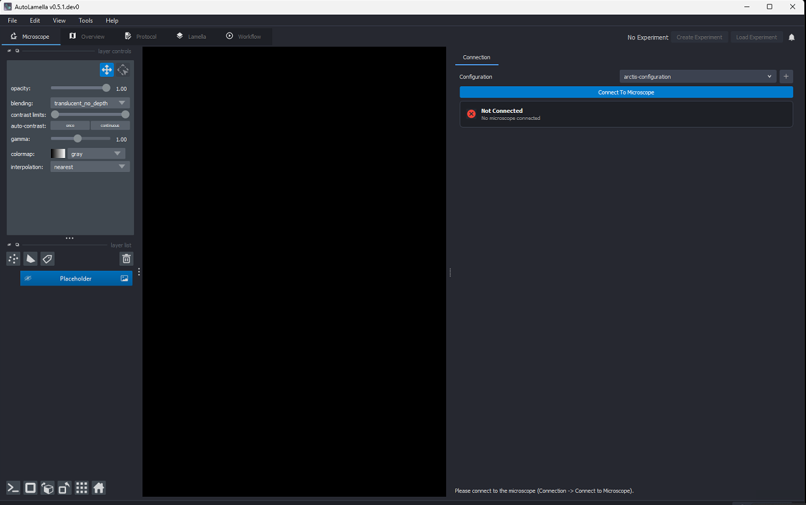
- Check that the correct configuration file is selected, then select 'Connect to Microscope'.
- Create a new experiment using the button in the top right corner:\
    
  - A new window will open, allowing you to specify the experiment details:\
    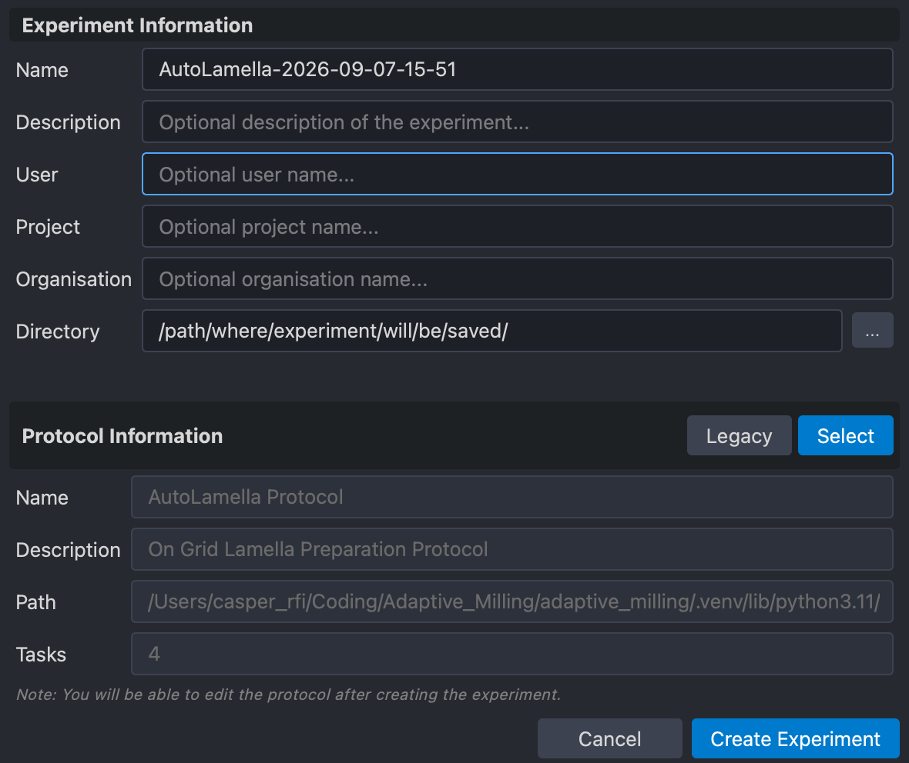
  - Load the protocol here by clicking 'Select', or use the default (if set). A protocol can be loaded later.

### Using a protocol file

Load an existing protocol file (File → Load Protocol). We recommend starting one of our [example protocols](#example-protocols) and customising to your requirements. You will need to set the `model_path` within the `AdaptivePolishing` config(s), either directly in the file or in AutoLamella.

Protocols can be edited in the UI in the Protocol tab (please see [Protocol files](#3-protocol-files-editing-and-further-details) section for further details).

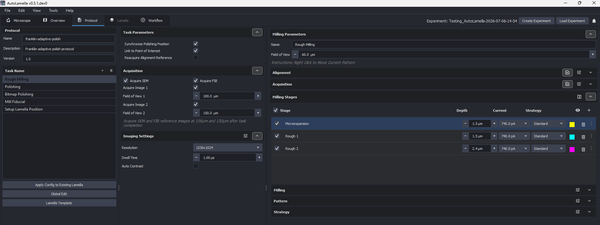

### Create a lamella overview (before GIS deposition)

- Set the stage tilt to your intended milling angle.
- Move the stage to the middle of the grid and set it to eucentric height.
- Overviews can be taken in the Overview tab: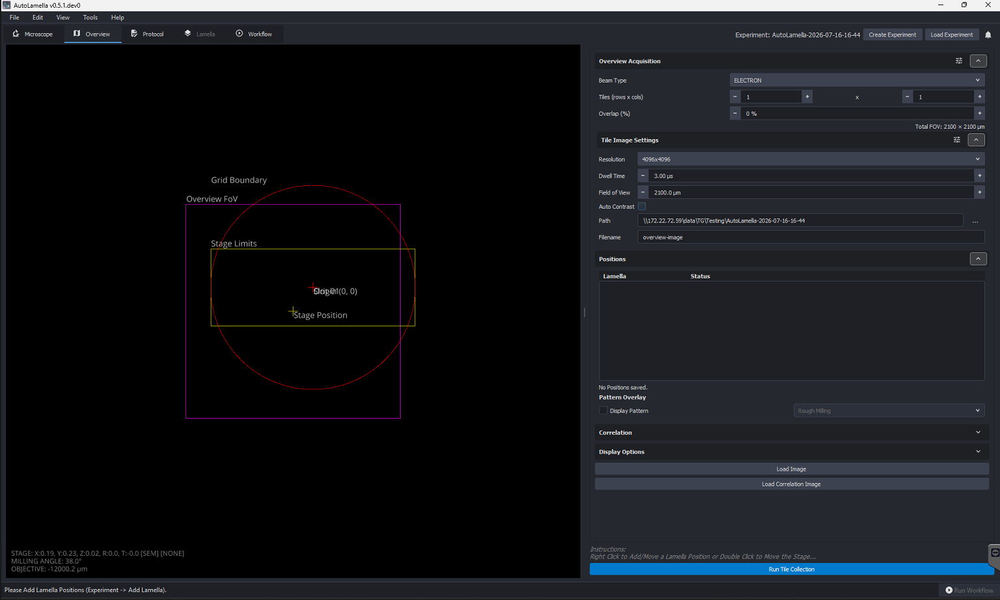
- Some suggested settings are below for a single high resolution overview image:
  - Set the Overview Acquisition settings:
    - Beam Type:      Electron
    - Field of View:  2100µm
    - Tiles:          1x1
    - Resolution:     4096x4096
    - Dwell Time:     3µs
    - Auto Contrast:  No
  - Set the electron beam to 2kV, 0.1nA.
  - Run Auto Contrast on a before acquiring (to avoid running it on the entire overview area).
- Click 'Run Tile Collection' to acquire.
- After the collection has finished GIS/sputter coat the grid using your usual coating procedure.

### Using the minimap

- Double-click to move the stage to this position in X-Y.
- You can add lamella sites by right clicking and clicking 'Add New Position Here'.
  - Added lamella sites will show up as turquoise squares and crosshair symbols, with the currently selected lamella site shown in green.\
    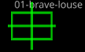
  - You can relocate the selected lamella site by right clicking on the new location and clicking 'Move Selected Position Here'.
- The current stage position is shown as a yellow '+' symbol.

### Setting up lamella sites

- Right click on the minimap to add lamella sites, as above.
- In the Workflow tab select all lamella, then tick the task 'Setup Lamella Position' and set it to supervised (see screenshot below).
- Click 'Run Workflow' (bottom right).
- In the microscope tab, for each lamella:
  - Set the coincident height using double-click to adjust the X-Y position in the SEM view and Alt + double-click to adjust the Z position in the FIB view (see fibsemOS documentation for further details). Take refernces images as you go.
    - Ensure the box for automatically taking FIB and SEM images on stage movement is ticked (Edit → Preferences → Movement) to make this easier.\
      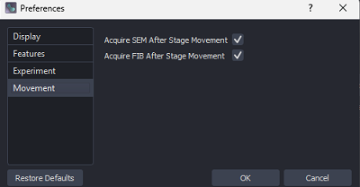
  - Adjust the X-Y position as required and click 'Continue'.
  - Adjust the lamella position by dragging the white marker, which represents the center of finished lamella, then click 'Continue'.
  - During the edit alignment area step, just click 'Continue'. This will be set later based on the fiducial location.

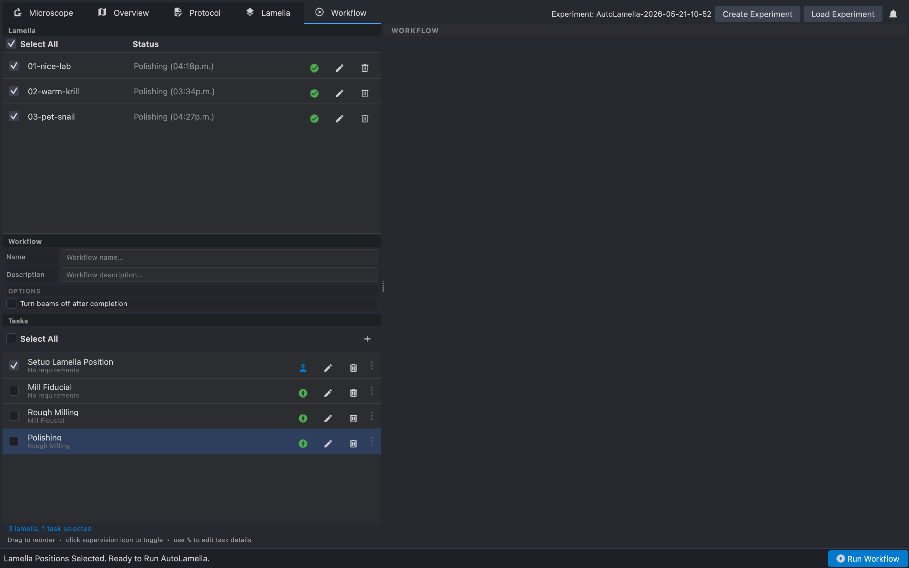

### Refining the fiducial position

- Go to Lamella tab.
- In Tasks, click 'Mill Fiducial'.
- In Patterns, open the advanced options (press the sliders/toggles button) and adjust the fiducial position in X and Y with the 'Point' field.
  - The fiducial is best placed on more stable material, such as grid bars, on a cell, or a section of foil with back ice. If you can, avoid placing the fiducial on foil only.

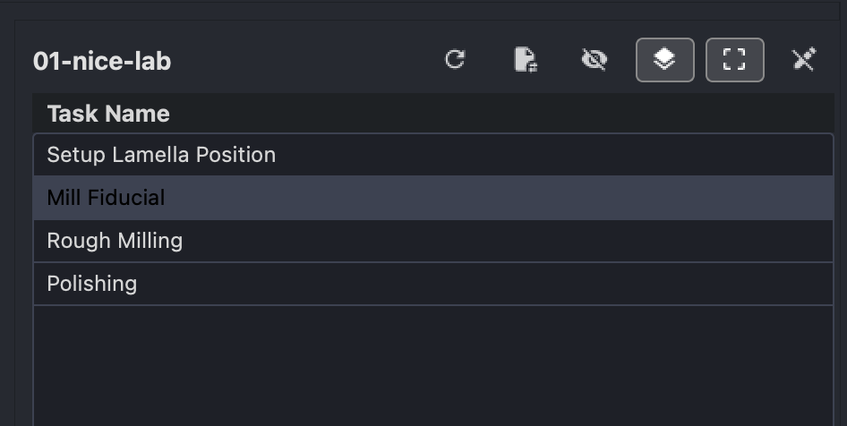

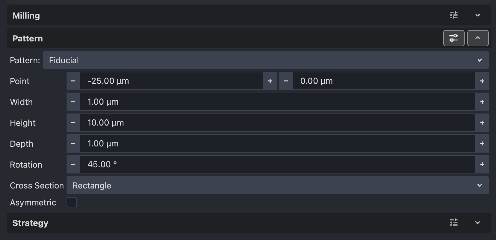

### Starting the milling

- Go to Workflow tab.
- Select all lamella.
- Select 'Mill Fiducial', 'Rough Milling' and 'Polishing' and make sure they are set to automatic (see screenshot below).
- Click Run Workflow to start the milling (bottom right hand side).

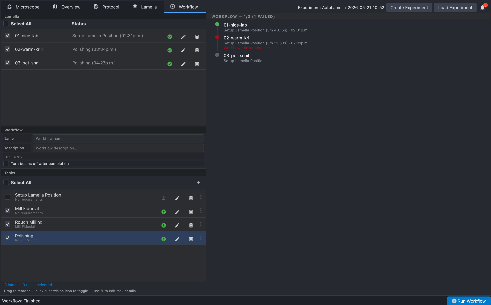

## 3. Protocol files (editing and further details)

### Example protocols

- [Protocol optimised for TFS Arctis with argon](src/example_configs/protocol_argon_ap_v1.yaml). This protocol has two stages of AdaptivePolishing, which we have found increases speed and reliability.
- [Protocol based on settings in our paper](src/example_configs/protocol-on-grid-ap.yaml). This is less well optimised and only uses one stage of AdaptivePolishing.

### Protocol editing

- Each milling stage can be selected in the Protocol tab and milling current and pattern parameters can be changed in the sections in the bottom right. Toggle the advanced settings to see more options. Please check the fibsemOS documentation for further details on protocols and protocol adjustments. For the task, we recommend the following Acquisition parameters:
  - Dwell time: 0.05 µs with 16 frame integrations at 3072 x 2048 pixels. The field of view for Adaptive Polishing SEM imaging is set in the strategy for the Adaptive Polishing stage(s).
- The 'AdaptivePolishing' strategy can be added as a stage in the 'Polishing' task. To do this, simply add a Polishing stage using the plus button shown in the red circle in the screenshot below.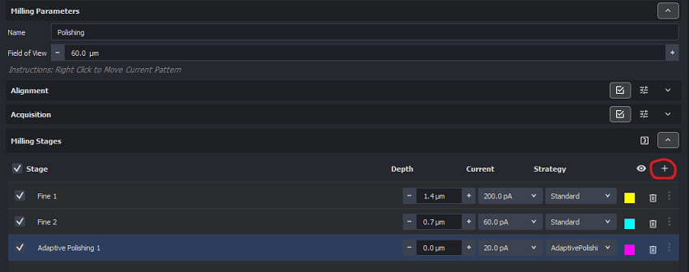
- You can rename the stage by clicking on the name.
- In the 'Strategy' section at the bottom, change the selected strategy to 'AdaptivePolishing'.
- The 'AdaptivePolishing' strategy has various settings that can be configured (see [Adaptive Polishing settings](#adaptive-polishing-settings) below).
- Note that you can add multiple Adaptive Polishing stages. This can be useful for collecting model training data, for example, as a second Adaptive Polishing stage can have settings that would deliberately destroy lamella (e.g. set GIS thickness thresholds to 0 µm, max. crack area to 2 µm²), providing useful training data to improve the segmentation model.

### Adaptive Polishing settings

| Setting                             | Description                                                                                            | Notes                                                                                                                                                                                               |
| ----------------------------------- | ------------------------------------------------------------------------------------------------------ | --------------------------------------------------------------------------------------------------------------------------------------------------------------------------------------------------- |
| **Model path**                      | Path to the SEM segmentation model weights (*.pth).                                                    | Models are available from zenodo: https://zenodo.org/records/21804785. We would recommend using AM_SEM_All_V01.pth ([download link](https://zenodo.org/records/21804785/files/AM_SEM_All_V01.pth)). |
| **Model generation**                | The generation of model to use.                                                                        | Defaults to the latest model generation if not specified. All current models are "1.0".                                                                                                             |
| **Minimum GIS thickness threshold** | Stop polishing if the local GIS thickness drops below this threshold.                                  | Consider adjusting this based on risk tolerance. Can be disabled by setting to 0.                                                                                                                   |
| **Median GIS thickness threshold**  | Stop polishing if the median GIS thickness across the width of the lamella drops below this threshold. | Consider adjusting this based on risk tolerance. Can be disabled by setting to 0.                                                                                                                   |
| **Max. crack area**                 | Stop polishing if the total crack area is above this threshold.                                        | Consider adjusting this based on your tolerance to cracks/holes.                                                                                                                                    |
| **Max. cycles**                     | Maximum adaptive polish cycles per lamella.                                                            | This should rarely (if ever) be why Adaptive Polishing stops, so can be set fairly high and forgotten.                                                                                              |

There are also advanced options that we don't recommend changing from their defaults but can be accessed by clicking the sliders/toggles button:

| Advanced Setting          | Description                                                                           | Notes                                                                                                                                                                                         |
| ------------------------- | ------------------------------------------------------------------------------------- | --------------------------------------------------------------------------------------------------------------------------------------------------------------------------------------------- |
| **Min. lamella area**     | Stop polishing if the segmented lamella area is smaller than this size.               | This may indicate that an alignment or major segmentation issue has occurred.                                                                                                                 |
| **Max. lamella drift**    | Stop polishing if the segmented lamella area has moved more than this between cycles. | This may indicate that an alignment or major segmentation issue has occurred.                                                                                                                 |
| **Align SEM**             | Centre the lamella in the SEM image before polishing.                                 | This corrects for any errors in coincident height when setting up the lamella site. This is highly recommended to be left on.                                                                 |
| **Save segmentations**    | Saves the raw and clean SEM segmentations.                                            | These segmentations are useful for improving segmentation models.                                                                                                                             |
| **GIS filter sigma**      | Sigma of the Gaussian used to smooth the GIS thickness measurements.                  |                                                                                                                                                                                               |
| **X-padding fraction**    | The fraction of the lamella width that the X-limits will be padded by.                | These X-limits determine the region that GIS thickness will be measured.                                                                                                                      |
| **Imaging Field of View** | The horizontal field width used for SEM imaging.                                      | This overrules the task acquisition parameters FOV. We recommend 40 µm, as we found that higher magnifications help model performance and most of the training data is at this magnification. |

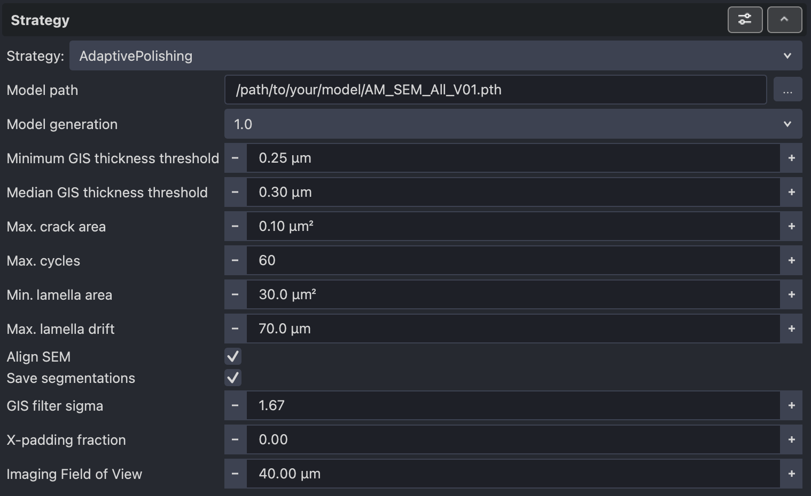

## 4. Outputs and assessing Adaptive Milling performance

- For each milling cycle Adaptive Polish will output a PNG file showing the SEM and FIB images, the segmented SEM image, the segmented SEM image after cleaning, and the GIS thickness plot (see example below).
- The plots are useful to track how well the Adaptive Polishing is performing, whether the segmentation is accurate, whether the milling boxes are well positioned and how the lamella is changing between cycles.
- These plots can be found at: `<Experiment>/<Lamella>/Milling/Polishing/adaptive_polish_<datetime_stamp>/plots/`
  - For example, `AutoLamella-2026-07-10-14-05/01-free-koala/Milling/Polishing/adaptive_polish_2026-07-10-02-52-47PM/plots/`
  - Within AutoLamella, the project directory can be opened via File → Open Experiment Directory

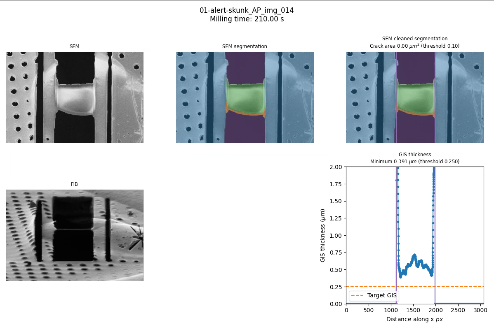
